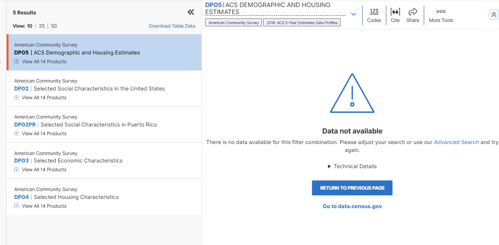

# covid-2020-counts
geog 458 lab 3

---

## **COVID Statistics in 2020**

----

### **Introduction**
The three additional maps in this project with the exception of the example earthquake map (index.html) all show the COVID statistics from 2020 within each US county. 

### **Map 1: Choropleth COVID Map**
Choroplethcovid.html is a map of the US counties in each US state, and is a choropleth map of the US counties. The map shows the COVID rates in 2020 for each county in each state, ranging from 0-100%. This map is designed to be an easy to understand visual representation of COVID rates in 2020 in each county by any user regardless of their background knowledge about COVID. The color ramp was chosen to go from lighter to darger color as the data is numeric. Some of the rates are above 100, but this is due to the "rates" value inthe geojson file. The full reason some of the rate values are above 100 is unknown and is probably an error in how the geojson was generated or is an error in the data itself. The orginal data was unable to be checked and viewed directly to verify this as the as the data source link provided resulted in "Data not available" as shown in the image below. 

### **Map 2: Proportional Symbol COVID Case Count Map**

### **Map 3: Proportional Symbol COVID Death Counts Map**

### **Libraries and Data Sources**
- Libraries: There was no libraries used for this project.
- Choropleth COVID Map (Map 1, choroplethcovid.html) source for us-counties.csv population data used for calculating covid rates is from 2018 ACS 5 year estimates: [https://data.census.gov/table/ACSDP5Y2018.DP05?g=0100000US$050000&d=ACS+5-Year+Estimates+Data+Profiles&hidePreview=true](https://data.census.gov/table/ACSDP5Y2018.DP05?g=0100000US$050000&d=ACS+5-Year+Estimates+Data+Profiles&hidePreview=true) 
- Proportional_symbolcovid (Map 2, proportional symbol map, proportional_symbolcovid.html) and covid_death_counts_propsym (Map 3, proportional symbol map, covid_death_counts_propsym.html) source for COVID cases/death rates for 2020 are from NYT (source for the proportional symbol map): [https://github.com/nytimes/covid-19-data/blob/43d32dde2f87bd4dafbb7d23f5d9e878124018b8/live](https://github.com/nytimes/covid-19-data/blob/43d32dde2f87bd4dafbb7d23f5d9e878124018b8/live)  
- US county boundary shapefile from the US census bureau (used for Map 1 (choroplethcovid.html), Map 2 (proportional_symbolcovid.html), and Map 3 (covid_death_counts_propsym)): [https://www.census.gov/geographies/mapping-files/time-series/geo/carto-boundary-file.html](https://www.census.gov/geographies/mapping-files/time-series/geo/carto-boundary-file.html)

